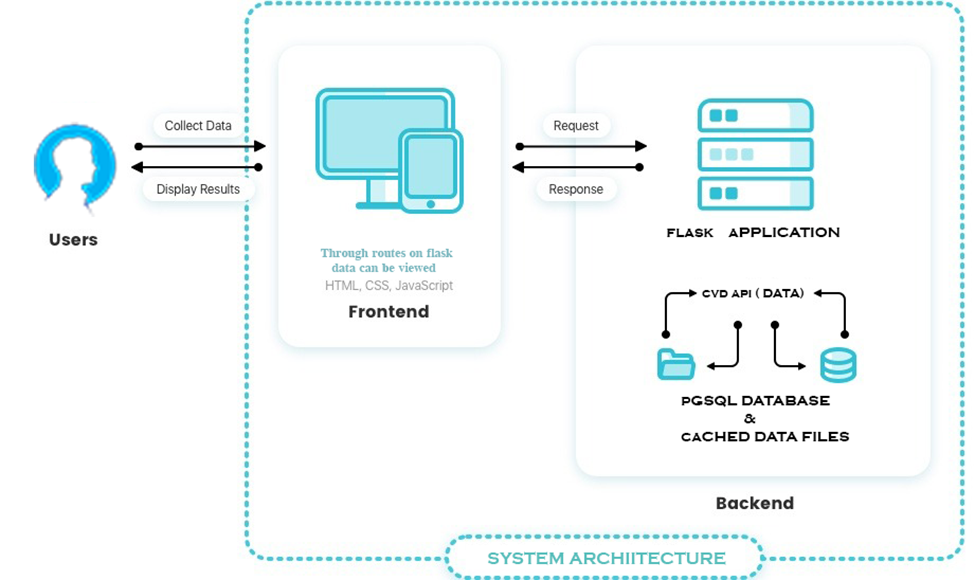

# CVE Management System

**Author:** Mouli Krishnan.A

## Executive Summary
The CVE Management System is a web-based application designed to empower security professionals and organizations in effectively managing and analyzing software vulnerabilities. This comprehensive solution offers robust functionalities for fetching, viewing, and analyzing CVE data, facilitating proactive risk mitigation strategies.

## System Architecture

The CVE Management System leverages a modern client-server architecture, ensuring optimal scalability and performance.
- **Client-Side:** Users interact with the system through a user-friendly web interface built with HTML, CSS, and JavaScript, providing a responsive and intuitive user experience.
- **Server-Side:** The Flask-powered backend server handles incoming HTTP requests, interacts with the PostgreSQL database, and delivers data through well-defined APIs for seamless frontend interaction.

## Core Components
1. **Backend Server:** Built with Flask, this server manages API requests, interacts with the database, and orchestrates data flow between the frontend and database.
2. **Frontend Interface:** This user-friendly interface allows users to browse CVE lists, explore detailed CVE information, and initiate data updates.
3. **PostgreSQL Database:** The central repository stores all CVE data, including vulnerability details, descriptions, metrics, weaknesses, configurations, and references.

## Backend Implementation

### 1. `connect_to_database()`
- **Description:** Establishes a connection to the PostgreSQL database using the provided connection details.

### 2. `index()`
- **Description:** Serves as the endpoint for displaying the list of CVEs. It retrieves the CVE data from the database, formats it, and renders the HTML template for the CVE main table.

### 3. `cve_detail(cve_id)`
- **Description:** Handles the display of detailed information for a specific CVE identified by its ID. It fetches the CVE details from the database based on the provided ID and renders the HTML template for the CVE details page.

### 4. `fetch_data()`
- **Description:** Fetches CVE data from an external source (NVD API) and stores it in the local PostgreSQL database using threads for asynchronous execution.

### 5. `read_start_index()`
- **Description:** Reads the start index from a file (`start_index.txt`) to resume the data fetching process from the last fetched index in case of interruption.

### 6. `write_start_index(startIndex)`
- **Description:** Writes the updated start index to a file (`start_index.txt`) after each iteration of the data fetching process.

### 7. `schedule_cve_update()`
- **Description:** Placeholder function for scheduling the CVE data update process to run automatically at regular intervals (every day at midnight).

### 8. `fetch()`
- **Description:** Serves as the endpoint for initiating the data fetching process. It starts the `fetch_data()` function in a new thread when a POST request is received.

## Frontend Implementation

## Database Schema

[Tasks to Do](https://drive.google.com/file/d/1UXqUZrTnqh3FkK1sGmKA1RR1WRd8shem/view?usp=sharing)

## Prerequisites
- PostgreSQL
- Flask
- psycopg2
- requests

## Installation
1. Install PostgreSQL and Flask in your local machine:
   - [PostgreSQL Download](https://www.postgresql.org/download/)
   - [Flask Installation](https://flask.palletsprojects.com/en/2.0.x/installation/)

2. Install project dependencies:
   pip install psycopg2-binary flask requests

3.Run the Flask application:
    -python app.py

## Conclusion
The CVE Management System is a valuable tool to proactively manage software vulnerabilities with well-designed error-handling capabilities.
